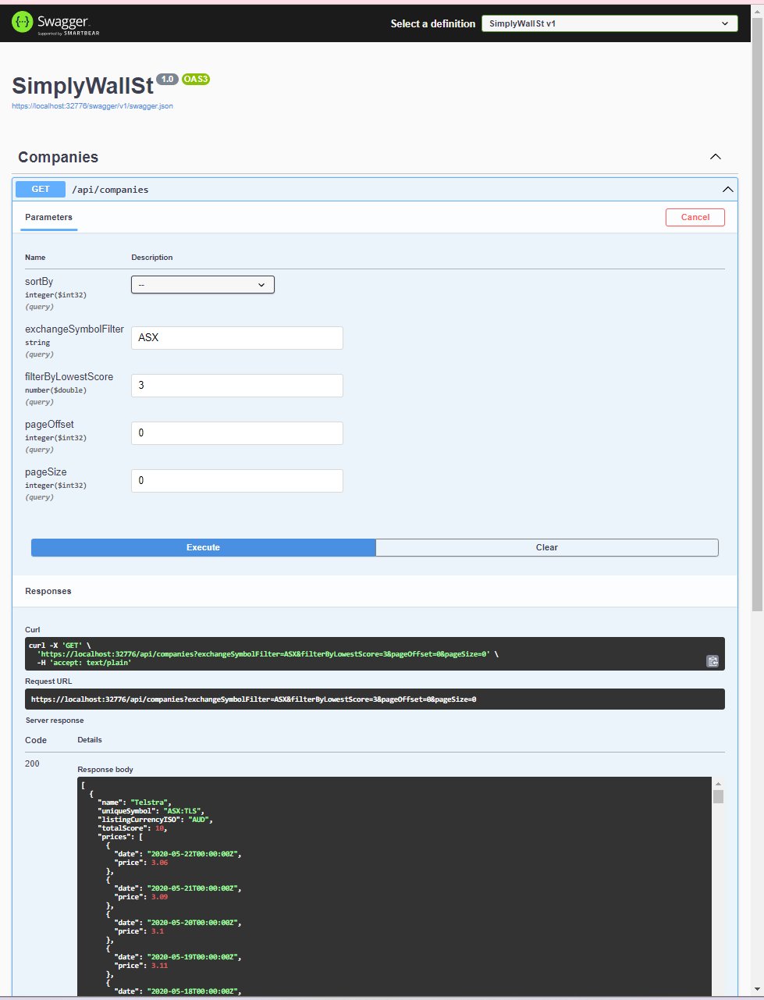

# SimplyWallSt
Simplywall.st challenge

# Assumptions and Explanations
The challenge was tackled with the following context:

* Changes to the provided SQLite database was avoided for ease of testing and compatibility with any alternate databases that the challenge's assessor may swap in. However, if changes to the SQLite database was allowed, I would like to have created a new table "swsCompanyVolatility" as a way of avoiding computing the volatility (variance) of stocks which would make the search query more efficient.
* As such, I have assumed for the purpose of this exercise that joins are allowed on the database. If changes would have been allowed on the database, I would perhaps have used a new swsCompanyVolatility table to query for volatility instead, this would avoid running an expensive query such as the one I included in DirectCompanyRepository.cs.
* My design, were this to be an actual production ready system would be to use an elastic search cluster with replicated data to more easily index and search according to the criteria. The elastic search cluster can be populated by a processor that subscribes to a kafka stream that receives data from the CDC output of a real database. This design will mean we can avoid joins and minimize index updating (when writing) on these tables while still providing efficiently searchable up-to-date data to the customer.
* Depending on the write cadence, a cache may be applicable for storing price data or score data. This enables looking up "last known price" without having to hit the database (or the ES cluster for that matter). Cache invalidation may be implemented if more up-to-date data is required. Currently, I've used memory cache to implement a simple LRU cache as a proof of concept.
* I have made certain assumptions on the validity of the data. Namely that each company must necessarily have at least one past price and a score. If the assumption is false, more error handling/sanity testing need to be added.
* If I had more time to allocate to this task, I would add component tests as the logic right now is database query heavy, and component/integration tests seem more appropriate. As this would have taken a bit too much time on my part (setting up a docker-compose and dockerfile for testing purposes then writing the tests themselves with proper http clients), I have instead added some unit tests for companysearcher, which seems like the only class with a bit of logic to test.

# Instructions to run
Solution has been tested on IISExpress as well as a Linux docker container. However, it has only been tested on a windows build environment.

To run, install Visual Studio (Community edition is fine) and Docker for Windows. It should be able to run by hitting Run within the IDE.

For deploying via CD, a docker-compose file will be more appropriate. Exact configuration will depend on what CI/CD tool it is being integrated with.

The database included as part of the git repository is an empty file. However, the default SQLite database should work if it were to overwrite src/SimplyWallSt/sws.sqlite3

Screenshot of generated swagger interface:

